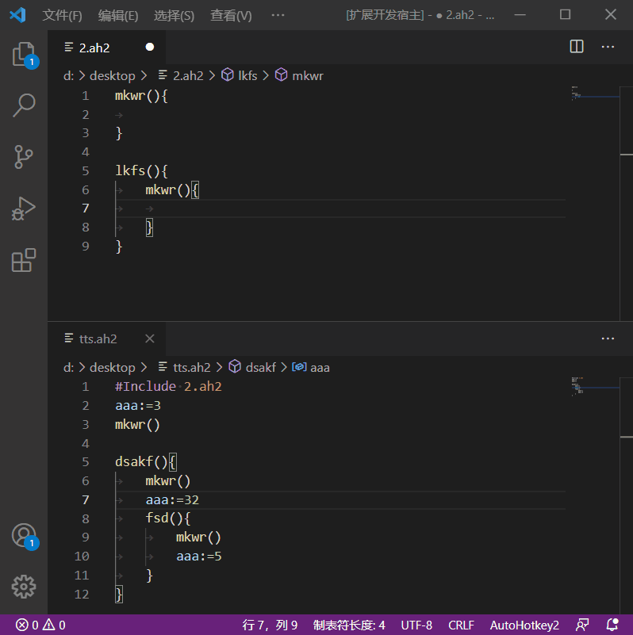
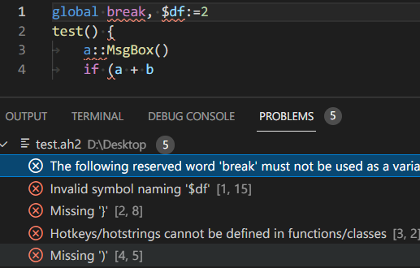
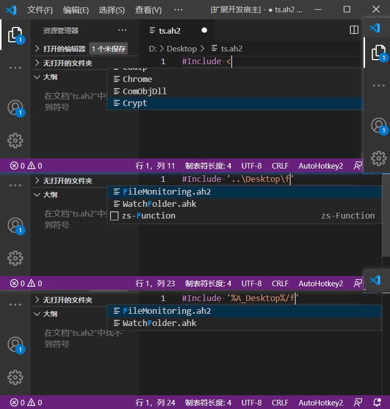
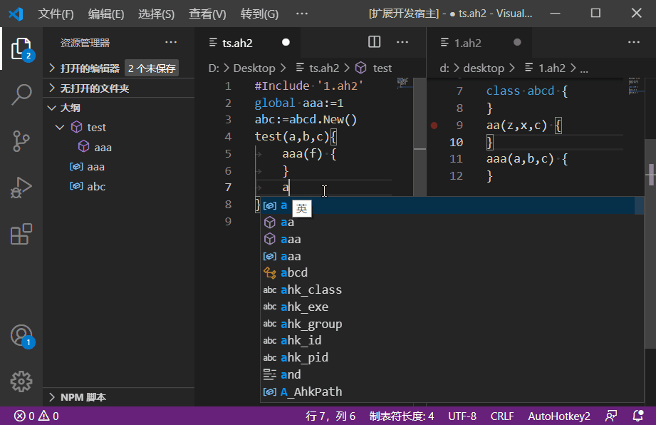
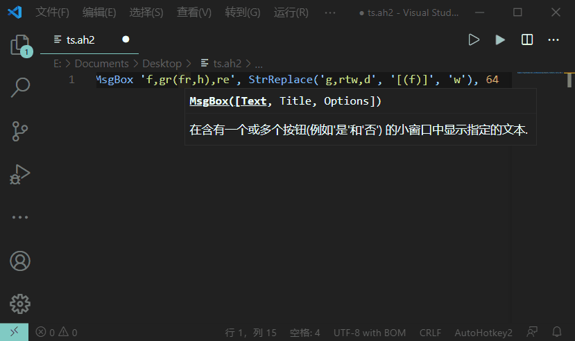
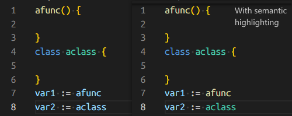
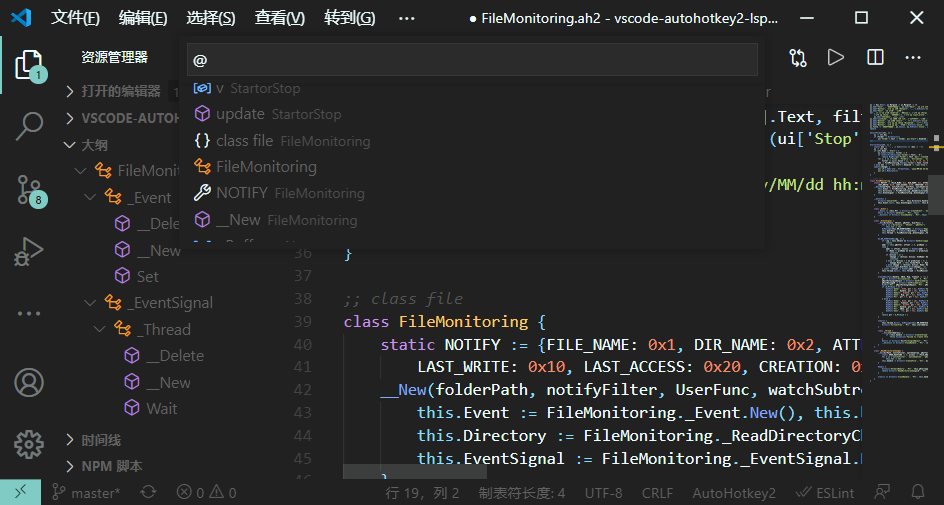
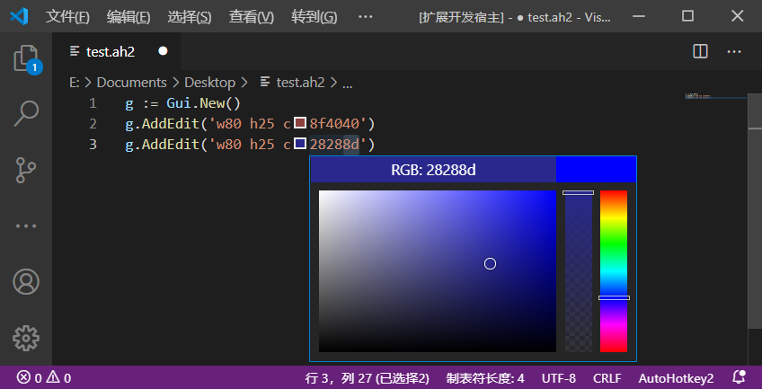
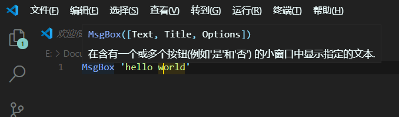
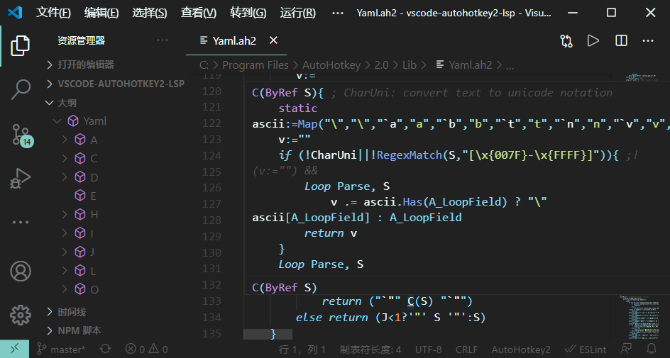

**English** | [中文](./README.zh-CN.md)

# AutoHotkey v2 Language Support

[](https://marketplace.visualstudio.com/items?itemName=thqby.vscode-autohotkey2-lsp)
[](https://marketplace.visualstudio.com/items?itemName=thqby.vscode-autohotkey2-lsp)
[](https://www.autohotkey.com/)

**Repositories**: [Github](https://github.com/thqby/vscode-autohotkey2-lsp) | [Gitee](https://gitee.com/orz707/vscode-autohotkey2-lsp)

AutoHotkey v2 Language support for VS Code, features realization based on v2 syntax analysis.
Supports running on the Web, such as `Chrome/Edge`. https://vscode.dev or https://github.dev/github/dev

-   [AutoHotkey v2 Language Support](#autohotkey-v2-language-support)
    -   [Language Features](#language-features)
        -   [Rename Symbol](#rename-symbol)
        -   [Diagnostics](#diagnostics)
        -   [IntelliSense](#intellisense)
        -   [Signature](#signature)
        -   [Document Symbol](#document-symbol)
        -   [Semantic Highlight](#semantic-highlight)
        -   [Tags](#tags)
        -   [Document Color](#document-color)
        -   [Hover](#hover)
        -   [Goto Definition](#goto-definition)
        -   [Find All References](#find-all-references)
        -   [CodeFormat](#codeformat)
        -   [Custom folding](#custom-folding)
    -   [Context Menu](#context-menu)
        -   [Quick Help](#quick-help)
        -   [Run Script](#run-script)
        -   [Run Selected Script](#run-selected-script)
        -   [Compile Script](#compile-script)
        -   [Debug Script](#debug-script)
        -   [Generate Comment](#generate-comment)
    -   [Use in other editors](#use-in-other-editors)
        -   [Sublime Text4](#sublime-text4)
        -   [Vim and Neovim](#vim-and-neovim)
        -   [Emacs](#Emacs)
    -   [Use in Web Browser](#use-in-web-browser)

## Language Features

### Rename Symbol

Rename variables and function names in the scope in batches.



### Diagnostics

Simple syntax error diagnosis.



### IntelliSense

Supports intelligent completion of variables, functions, parameters, class names, and method names within the scope (by simple type deduction), and supports the completion of include files and function libraries.





### Signature

Support for intelligent prompts for function parameters.



### Document Symbol

1. Displays class, method, function, variable, label, hotkey, hot string, block information in the left outline column.
2. press Ctrl + P, Input @symbol_name to retrieve and jump
3. You can comment a method with a semicolon or /\* \*/ on the top line of a function, variable. Jsdoc-style annotations can mark variable types.

<!-- just for highlight -->

```js
/**
 * @param {Array} a - a param
 * @return {Integer}
 */
fn(a*) {
  /** @type {Map} */
  d := Map()
  /**
   * @var {Map} e
   * @var {Object} f
   */
  e := Map(), f := {}
  /** @type {(a,b)=>Integer} */
  cb := (a, b) => a + b
  /** @type {ComObject<Excel.Sheet.12,Workbook>} */
  wb := ComObject('Excel.Sheet.12')
  return a[1] + a[2]
}
class abc {
  /** @type {Map} */
  p := dosomethingandreturnmap()
}
```

### Semantic Highlight

Semantic highlighting is an addition to syntax highlighting, resolves symbols in the context of a project. The editor applies the highlighting from semantic tokens on top of the highlighting from grammars.



### Tags

usage: Add `;;`(default) or `; TODO ` to the comment code Tags.



### Document Color

Compute and resolve colors inside a document to provide color picker in editor.



### Hover

Supports hover prompts and comments for scoped variables, functions, global classes, and labels.  
usage: Move the mouse over the symbol.



### Goto Definition

1. Support for jumping to the declaration location of scoped variables, functions, global classes, and labels.
2. usage: Press ctrl Then move the mouse over to the code and click.



### Find All References

See all the source code locations where a certain variable/function is being used.

### CodeFormat

usage:

-   Right-click the popup menu and click "Format document".
-   Press `Shift+Alt+F`.
-   Supports formatting code blocks when typing '}', formatting lines and indenting lines when typing '\n'. (`editor.formatOnType` needs to be enabled)
-   Supports the use of formatting instructions `;@format array_style: collapse, object_style: expand` to change the object style of different blocks


### Custom folding

Fold the part between `;@region tag` and `;@endregion`, `;{` and `;}`

```ini
;#region tag
code
;#endregion
```

## Context Menu

### Quick Help

Open the help file and navigate to the keyword at the current cursor.

### Run Script

Run the currently open script.

### Run Selected Script

Run the code snippet at the cursor selection.

### Compile Script

Compile the script to generate executable EXE files.

### Debug Script

No additional configuration is required to start the installed Debug extensions, and support debugging with parameters.

### Generate Comment

Generate JSDOC-style comments for a function or method.

## Use in other editors

1. Install [Node.js](https://nodejs.org/en/download/).
2. Download vscode-autohotkey2-lsp server using command line, or download and unpack through [vscode marketplace](https://marketplace.visualstudio.com/items?itemName=thqby.vscode-autohotkey2-lsp).

```shell
mkdir vscode-autohotkey2-lsp
cd vscode-autohotkey2-lsp
curl -L -o install.js https://raw.githubusercontent.com/thqby/vscode-autohotkey2-lsp/main/tools/install.js
node install.js
```

3. Set the LSP configuration of the editor that support [LSP(Language Server Protocol)](https://microsoft.github.io/language-server-protocol/), such as Sublime Text4, Vim, Neovim, Emacs, [etc](https://microsoft.github.io/language-server-protocol/implementors/tools/).

### Sublime Text4

-   `Package Control: Install Package`, and install [Sublime LSP](https://github.com/sublimelsp/LSP) plug-in.
-   `Preferences: LSP Settings`, add lsp configuration, language selector, and syntax highlighting. This is a simple example [syntax highlighting](https://github.com/thqby/vscode-autohotkey2-lsp/files/9843973/AutoHotkey2.sublime-syntax.zip), save the file in a similar path `C:\Users\<USERNAME>\AppData\Roaming\Sublime Text\Packages\User\LSP-ahk2\AutoHotkey2.sublime-syntax`.

```json
{
	"clients": {
		"lsp-ahk2": {
			"enabled": true,
			"command": [
				"node",
				"<VSCODE-AUTOHOTKEY2-LSP>/server/dist/server.js",
				"--stdio"
			], // Update the path of node.exe(maybe it's already in PATH, so you don't need to set it) and the folder of vscode-autohotkey2-lsp
			"selector": "source.ahk2", // Same as scope in AutoHotkey2.sublime-syntax
			"schemes": ["file", "buffer", "res"],
			"initializationOptions": {
				"locale": "en-us", // or "zh-cn"
				"AutoLibInclude": "Disabled", // or "Local" or "User and Standard" or "All"
				"CommentTags": "^;;\\s*(?<tag>.+)",
				"CompleteFunctionParens": false,
				"Diagnostics": {
					"ClassStaticMemberCheck": true,
					"ParamsCheck": true
				},
				"ActionWhenV1IsDetected": "Continue",
				"FormatOptions": {
					"array_style": "none", // or "collapse" or "expand"
					"break_chained_methods": false,
					"ignore_comment": false,
					"indent_string": "\t",
					"max_preserve_newlines": 2,
					"brace_style": "One True Brace", // or "Allman" or "One True Brace Variant"
					"object_style": "none", // or "collapse" or "expand"
					"preserve_newlines": true,
					"space_after_double_colon": true,
					"space_before_conditional": true,
					"space_in_empty_paren": false,
					"space_in_other": true,
					"space_in_paren": false,
					"wrap_line_length": 0
				},
				"InterpreterPath": "C:/Program Files/AutoHotkey/v2/AutoHotkey.exe",
				"WorkingDirs": [],
				"SymbolFoldingFromOpenBrace": false
			}
		}
	},
	"semantic_highlighting": true
}
```

### Vim and Neovim

#### COC

-   Download [coc.nvim plugin](https://github.com/neoclide/coc.nvim).

```bat
cd $VIMRUNTIME\plugin
git clone --branch release https://github.com/neoclide/coc.nvim.git --depth=1
```

-   Open (n)vim and enter the command `:CocConfig` to enter the `coc.nvim` configuration file to add configuration information.

```json
{
	"languageserver": {
		"lsp-ahk2": {
			"module": "<VSCODE-AUTOHOTKEY2-LSP>/server/dist/server.js",
			"filetypes": ["autohotkey"],
			"args": ["--node-ipc"],
			"initializationOptions": {
				// Same as initializationOptions for Sublime Text4
			}
		}
	}
}
```

#### nvim-lspconfig

-   Download [nvim-lspconfig](https://github.com/neovim/nvim-lspconfig).
-   Add the following to your NVIM configuration (init.lua e.g.). Ensure that `cmd` points to the path of your vscode-autohotkey2-lsp installation and `InterpreterPath` points to your AHK exe.

```lua
local function custom_attach(client, bufnr)
  require("lsp_signature").on_attach({
    bind = true,
    use_lspsaga = false,
    floating_window = true,
    fix_pos = true,
    hint_enable = true,
    hi_parameter = "Search",
    handler_opts = { "double" },
  })
end

local ahk2_configs = {
  autostart = true,
  cmd = {
    "node",
    vim.fn.expand("$HOME/vscode-autohotkey2-lsp/server/dist/server.js"),
    "--stdio"
  },
  filetypes = { "ahk", "autohotkey", "ah2" },
  init_options = {
    locale = "en-us",
    InterpreterPath = "C:/Program Files/AutoHotkey/v2/AutoHotkey.exe",
    -- Same as initializationOptions for Sublime Text4, convert json literal to lua dictionary literal
  },
  single_file_support = true,
  flags = { debounce_text_changes = 500 },
  capabilities = capabilities,
  on_attach = custom_attach,
}
local configs = require "lspconfig.configs"
configs["ahk2"] = { default_config = ahk2_configs }
local nvim_lsp = require("lspconfig")
nvim_lsp.ahk2.setup({})
```

### Emacs

#### Eglot

-   Add the following lines to your emacs config file

```emacs-lisp
(add-to-list 'eglot-server-programs '(ahk-mode "node" "<VSCODE-AUTOHOTKEY2-LSP>/server/dist/server.js" "--stdio"))

```

## Use in Web Browser

visit https://github.dev or https://vscode.dev in `Chrome/Edge`, and install `thqby.vscode-autohotkey2-lsp`
