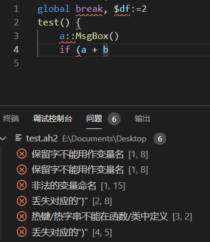

[English](./README.md) | **中文**

# AutoHotkey v2 语言支持

(此软件源是 https://github.com/thqby/vscode-autohotkey2-lsp 的分叉)

[](https://marketplace.visualstudio.com/items?itemName=thqby.vscode-autohotkey2-lsp)
[](https://marketplace.visualstudio.com/items?itemName=thqby.vscode-autohotkey2-lsp)
[](https://www.autohotkey.com/)

**仓库**: [Github](https://github.com/thqby/vscode-autohotkey2-lsp) | [Gitee](https://gitee.com/orz707/vscode-autohotkey2-lsp)

AutoHotkey v2 语言支持 for VS Code, 功能实现基于 v2 语法分析。
支持在`Chrome/Edge`等浏览器中使用 https://vscode.dev 或 https://github.dev/github/dev

- [AutoHotkey v2 语言支持](#autohotkey-v2-语言支持)
  - [语言特性](#语言特性)
    - [重命名符号](#重命名符号)
    - [错误诊断](#错误诊断)
    - [智能感知](#智能感知)
    - [智能提示](#智能提示)
    - [大纲](#大纲)
    - [语义高亮](#语义高亮)
    - [代码标记](#代码标记)
    - [颜色提示](#颜色提示)
    - [悬停提示](#悬停提示)
    - [转到定义](#转到定义)
    - [查找所有引用](#查找所有引用)
    - [代码格式化](#代码格式化)
    - [自定义折叠](#自定义折叠)
    - [声明文件](#声明文件)
  - [上下文菜单](#上下文菜单)
    - [快速帮助](#快速帮助)
    - [运行脚本](#运行脚本)
    - [运行选定的脚本](#运行选定的脚本)
    - [编译脚本](#编译脚本)
    - [调试脚本](#调试脚本)
    - [生成注释](#生成注释)
  - [在其他编辑器中使用](#在其他编辑器中使用)
    - [Sublime Text 4](#sublime-text-4)
    - [Vim 和 Neovim](#vim-和-neovim)
    - [Emacs](#Emacs)
  - [在 Web 浏览器中使用](#在-web-浏览器中使用)

## 语言特性

### 重命名符号

作用域范围内的变量、函数名批量重命名。


### 错误诊断

简单语法错误诊断。



### 智能感知

支持对作用域范围内的变量、函数、参数、类名、方法名智能补全(简单的类型推导)，支持对 include 文件和函数库补全。


### 智能提示

支持对函数、方法参数的智能提示。


### 大纲

1. 在左侧大纲栏目显示类、方法、函数、变量、标签、热键、热字串、区块信息
2. 按 Ctrl + P, 输入@符号名检索并跳转
3. 您可以在函数、变量的上一行使用分号或/\* \*/向方法添加注释, jsdoc 样式的注释可以标记变量类型

<!-- just for highlight -->

```js
/**
 * @param {Array} a - a param
 * @return {Integer}
 */
fn(a*) {
  /** @type {Map} */
  d := Map()
  /**
   * @var {Map} e
   * @var {Object} f
   */
  e := Map(), f := {}
  /** @type {(a,b)=>Integer} */
  cb := (a, b) => a + b
  /** @type {ComObject<Excel.Sheet.12,Workbook>} */
  wb := ComObject('Excel.Sheet.12')
  return a[1] + a[2]
}
class abc {
  /** @type {Map} */
  p := dosomethingandreturnmap()
}
```

### 语义高亮

语义高亮显示是语法高亮显示的补充，改进和改进语法中的语法突出显示。编辑器在来自语法的高亮显示之上应用来自语义标记的高亮显示。


### 代码标记

用法: 在注释代码块中添加`;;`(默认)或`; TODO `  


### 颜色提示

计算并解析文档中的颜色，并提供颜色选择器更直观地修改颜色数据。


### 悬停提示

支持对作用域范围内变量、函数、全局类、标签的悬停提示并显示相关备注。  
用法: 移动鼠标到相关符号上。  


### 转到定义

1. 支持跳转到作用域范围内变量、函数、全局类、标签的声明位置。
2. 用法: 按住 ctrl 然后移动鼠标到代码处点击。


### 查找所有引用

查看正在使用某个变量/函数的所有源代码位置。

### 代码格式化

用法:

- 右键弹出菜单然后点击 格式化文档。
- 或按 `Shift+Alt+F`。
- 支持在键入`}`时格式化代码块，在代码行结束处键入`\n`时格式化行并缩进。支持在代码区(非注释、字符串)输入中文标点时替换为英文标点。 (需要开启`editor.format OnType`)
- 支持使用格式化指令`;@format array_style: collapse, object_style: expand`改变不同块的对象样式


### 自定义折叠

折叠`;@region tag`和`;@endregion`之间部分, `;{`和`;}`之间部分

```ini
;@region tag
code
;@endregion
```

### 声明文件

声明文件是以 .d.ahk 为文件名后缀的文件, 用来描述已实现的函数或类等, 不包含代码的实现部分, 默认被同名的ahk文件引用, 语法参考扩展提供的 `ahk2.d.ahk`. 声明文件可以扩展或改写ahk内置函数或类的声明, 也可以将注释文档从源码中分离来提供多语言版本的智能感知等.

```
; array.d.ahk
; #ClsName represents the ahk built-in class
/** @extends {#Array} */
class Array<T = Any> {
  /** jsdoc-默认 */
  Filter(FilterFunc) => Array<T>
}

; array.zh-cn.d.ahk
; #ClsName 表示ahk内置类
/** @extends {#Array} */
class Array<T = Any> {
  /** jsdoc-zh */
  Filter(FilterFunc) => Array<T>
}

; array.ahk
; %A_Locale% 是VSCode的显示语言
;@reference array.%A_Locale%.d.ahk
Array.Prototype.DefineProp('Filter', { call: Array_Filter_impl })
```

## 上下文菜单

### 快速帮助

打开帮助文件并导航到当前光标处的关键字。

### 运行脚本

运行当前打开的脚本。

### 运行选定的脚本

运行光标选择范围的代码片段。

### 编译脚本

编译脚本生成可执行的 EXE 文件。

### 调试脚本

无需额外配置即可启动已安装的调试扩展，支持带参数调试。

### 生成注释

为函数或方法生成 JSDOC 样式的注释文档。

## 在其他编辑器中使用

1. 安装[Node.js](https://nodejs.org/en/download/)。
2. 用命令行下载 vscode-autohotkey2-lsp 服务端, 或通过[vscode marketplace](https://marketplace.visualstudio.com/items?itemName=thqby.vscode-autohotkey2-lsp)下载并解包。

```shell
mkdir vscode-autohotkey2-lsp
cd vscode-autohotkey2-lsp
curl.exe -L -o install.js https://raw.githubusercontent.com/thqby/vscode-autohotkey2-lsp/main/tools/install.js
node install.js
```

3. 设置支持[LSP(语言服务器协议)](https://microsoft.github.io/language-server-protocol/)的编辑器的 LSP 配置, 例如 Sublime Text4, Vim, Neovim, Emacs, [等](https://microsoft.github.io/language-server-protocol/implementors/tools/)。

### Sublime Text 4

- `Package Control: Install Package`, 安装[Sublime LSP](https://github.com/sublimelsp/LSP)插件
- `Preferences: LSP Settings`, 增加 lsp 配置、语言选择器和语法高亮. 这是一个简单的[语法高亮示例](https://github.com/thqby/vscode-autohotkey2-lsp/files/9843973/AutoHotkey2.sublime-syntax.zip), 存放在类似路径下 `C:\Users\<USERNAME>\AppData\Roaming\Sublime Text\Packages\User\LSP-ahk2\AutoHotkey2.sublime-syntax`

```json
{
	"clients": {
		"lsp-ahk2": {
			"enabled": true,
			"command": [
				"node",
				"<VSCODE-AUTOHOTKEY2-LSP>/server/dist/server.js",
				"--stdio"
			], // 更新node.exe的路径(可能已经在环境变量中，所以你不需要设置)和vscode-autohotkey2-lsp的文件夹
			"selector": "source.ahk2", // 与AutoHotkey2.sublime-syntax中的scope相同
			"schemes": ["file", "buffer", "res"],
			"initializationOptions": {
				"locale": "en-us", // or "zh-cn"
				"AutoLibInclude": "Disabled", // or "Local" or "User and Standard" or "All"
				"CommentTags": "^;;\\s*(?<tag>.+)",
				"CompleteFunctionParens": false,
				"Diagnostics": {
					"ClassStaticMemberCheck": true,
					"ParamsCheck": true
				},
				"ActionWhenV1IsDetected": "Continue",
				"FormatOptions": {
					"array_style": "none", // or "collapse" or "expand"
					"break_chained_methods": false,
					"ignore_comment": false,
					"indent_string": "\t",
					"max_preserve_newlines": 2,
					"brace_style": "One True Brace", // or "Allman" or "One True Brace Variant"
					"object_style": "none", // or "collapse" or "expand"
					"preserve_newlines": true,
					"space_after_double_colon": true,
					"space_before_conditional": true,
					"space_in_empty_paren": false,
					"space_in_other": true,
					"space_in_paren": false,
					"wrap_line_length": 0
				},
				"InterpreterPath": "C:/Program Files/AutoHotkey/v2/AutoHotkey.exe",
				"WorkingDirs": [],
				"SymbolFoldingFromOpenBrace": false
			}
		}
	},
	"semantic_highlighting": true
}
```

### Vim 和 Neovim

#### COC

- 下载[coc.nvim 插件](https://github.com/neoclide/coc.nvim)。

```bat
cd $VIMRUNTIME\plugin
git clone --branch release https://github.com/neoclide/coc.nvim.git --depth=1
```

- 打开(n)vim, 输入命令 `:CocConfig` 进入`coc.nvim`配置文件增加配置信息。

```json
{
	"languageserver": {
		"lsp-ahk2": {
			"module": "<VSCODE-AUTOHOTKEY2-LSP>/server/dist/server.js",
			"filetypes": ["autohotkey"],
			"args": ["--node-ipc"],
			"initializationOptions": {
				// Same as initializationOptions for Sublime Text4
			}
		}
	}
}
```

#### nvim-lspconfig

- 下载[nvim-lspconfig](https://github.com/neovim/nvim-lspconfig)。
- 将以下内容添加到您的NVIM配置中(init.lua 等). 确定`cmd`指向vscode-autohotkey2-lsp的安装路径，`InterpreterPath`指向AHK exe.

```lua
local function custom_attach(client, bufnr)
  require("lsp_signature").on_attach({
    bind = true,
    use_lspsaga = false,
    floating_window = true,
    fix_pos = true,
    hint_enable = true,
    hi_parameter = "Search",
    handler_opts = { "double" },
  })
end

local ahk2_configs = {
  autostart = true,
  cmd = {
    "node",
    vim.fn.expand("$HOME/vscode-autohotkey2-lsp/server/dist/server.js"),
    "--stdio"
  },
  filetypes = { "ahk", "autohotkey", "ah2" },
  init_options = {
    locale = "en-us",
    InterpreterPath = "C:/Program Files/AutoHotkey/v2/AutoHotkey.exe",
    -- Same as initializationOptions for Sublime Text4, convert json literal to lua dictionary literal
  },
  single_file_support = true,
  flags = { debounce_text_changes = 500 },
  capabilities = capabilities,
  on_attach = custom_attach,
}
local configs = require "lspconfig.configs"
configs["ahk2"] = { default_config = ahk2_configs }
local nvim_lsp = require("lspconfig")
nvim_lsp.ahk2.setup({})
```

### Emacs

#### Eglot

- 将以下内容添加到您的emacs配置文件中

```emacs-lisp
(add-to-list 'eglot-server-programs '(ahk-mode "node" "<VSCODE-AUTOHOTKEY2-LSP>/server/dist/server.js" "--stdio"))

```

## 在 Web 浏览器中使用

在`Chrome/Edge`中打开 https://github.dev 或 https://vscode.dev, 然后安装`thqby.vscode-autohotkey2-lsp`。
